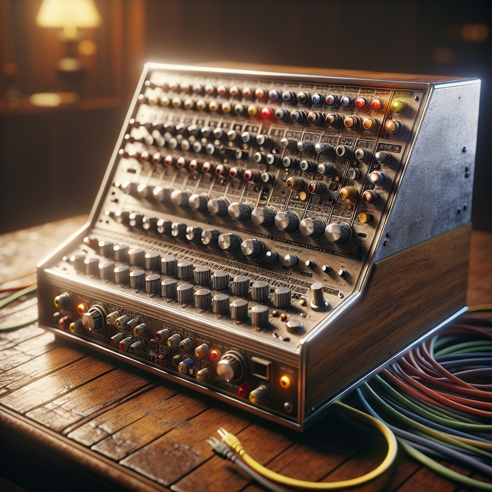

[Back to index page](https://pip-01.github.io/ET/)
  

## <u>Analogue Computers</u>

#### Course Outline:
  
[1. Introduction to Analogue Computers](https://pip-01.github.io/ET/analogue_computers#1-introduction-to-analogue-computers)  
[2. History of Analogue Computers](https://pip-01.github.io/ET/analogue_computers#2-history-of-analogue-computers)  
[3. Components of Analogue Computers](https://pip-01.github.io/ET/analogue_computers#3-components-of-analogue-computers)  
[4. Types of Analogue Computers](https://pip-01.github.io/ET/analogue_computers#4-types-of-analogue-computers)  
[5. Working Principle Explained with an Example](https://pip-01.github.io/ET/analogue_computers#5-working-principle-explained-with-an-example)  
[6. Advantages of Analogue Computers](https://pip-01.github.io/ET/analogue_computers#6-advantages-of-analogue-computers)  
[7. Limitations of Analogue Computers](https://pip-01.github.io/ET/analogue_computers#7-limitations-of-analogue-computers)  
[8. Key Comparisons Between Analogue and Digital Computers](https://pip-01.github.io/ET/analogue_computers#8-key-comparisons-between-analogue-and-digital-computers)  
[9. Further Constraints of Analogue Computers](https://pip-01.github.io/ET/analogue_computers#9-limitations-of-analogue-computers)  
[10. Modern Use Cases of Analogue Computers](https://pip-01.github.io/ET/analogue_computers#10-modern-use-cases-of-analogue-computers)  
[11. Potential Applications of Analogue Computers](https://pip-01.github.io/ET/analogue_computers#11-potential-applications-of-analogue-computers)  

---  
  

### 1. Introduction to Analogue Computers  

Analogue computers are devices that process data represented in a continuous form, as opposed to digital computers which use discrete values. They manipulate physical quantities such as voltage, current, or mechanical motion to simulate real-world systems and solve problems.

##### Key Features of Analogue Computers

1. **Continuous Data Representation**
   - Unlike digital computers that work with binary numbers (0s and 1s), analogue computers represent information in a way that can take on any value within a range.
  
2. **Real-Time Processing**
   - These systems operate in real-time, making them suitable for applications where immediate feedback is crucial.

3. **Physical Components**
   - Typically consist of resistors, capacitors, operational amplifiers, and other electronic components that directly model the problem being solved.

4. **Simulation Capabilities**
   - Ideal for simulating dynamic systems like electrical circuits, mechanical systems (e.g., pendulums), or fluid dynamics.

5. **Limited Precision**
   - While they can provide quick results for certain types of problems, their precision is often limited compared to digital counterparts due to noise and component tolerances.

##### Historical Context

- Developed during World War II and the early Cold War era when complex calculations were needed quickly.
- Examples include the differential analyzer used for solving differential equations and flight simulators used by engineers in aeronautics.

##### Common Applications

1. **Engineering Simulations:**
   - Used extensively in fields like aerospace engineering to model aircraft behavior under various conditions.
  
2. **Control Systems:**
   - Employed in controlling processes such as temperature regulation or speed control through feedback mechanisms.
  
3. **Signal Processing:**
   - Useful in audio processing where sound waves are manipulated continuously rather than discretely sampled.

4. **Education:**
    - Often utilized as teaching tools to illustrate concepts related to physics and engineering principles through practical experiments.

##### Advantages of Analogue Computers

- Can handle complex mathematical models more intuitively because they mirror physical processes.
- Generally faster than digital computers for specific tasks since they do not require conversion between different formats.
  
##### Disadvantages of Analogue Computers 

- Less flexible than digital computers; changing parameters often requires physical adjustments.
- Limited accuracy due to inherent noise in electronic components; small variations can lead to significant errors over time.

### Conclusion

Analogue computers play an important role in various fields by providing solutions through continuous data representation and simulation capabilities. Understanding their function helps appreciate how we model real-world phenomena using technology effectively!
Analogue computers are a type of computing device that manipulate continuous data rather than discrete values. They have been used for various applications, especially in fields where real-world phenomena can be modeled through physical quantities such as voltage, current, or mechanical movement.

##### Key Concepts of Analogue Computers

1. **Continuous Data Representation**
   - Unlike digital computers that use binary (0s and 1s), analogue computers represent information using continuous signals.
   - For example, the varying voltage levels in an electrical circuit can represent different values.

2. **Components of Analogue Computers**
   - **Operational Amplifiers**: These are crucial components used to perform mathematical operations like addition, subtraction, integration, and differentiation on the input signals.
   - **Resistors and Capacitors**: Used to control signal flow and store energy temporarily; they help shape the behavior of circuits.
   - **Potentiometers**: Variable resistors that allow users to adjust parameters manually.

3. **Mathematical Operations**
   - Analogue computers execute calculations by simulating equations with physical systems.
     - For instance:
       * An integrator circuit produces an output voltage proportional to the integral of its input signal over time.
       * A differentiator circuit gives an output proportional to the rate of change (derivative) of its input signal.

4. **Applications**
   - Historically used in engineering simulations (e.g., flight simulators).
   - Control systems for machinery where real-time adjustments are necessary (e.g., speed regulators).
   - Scientific research for modeling complex dynamic systems like weather patterns or chemical reactions.

5. **Advantages Over Digital Computers**
    - Can process multiple streams of data simultaneously due to their continuous nature.
    - Often faster for specific tasks involving differential equations or real-time processing since they directly simulate physical processes.

6. **Limitations**
    - Less precise than digital computers; accuracy is limited by noise and component tolerances.
    - More challenging to program compared to digital counterparts which utilize high-level programming languages.

7. **Modern Context**
    - While less common today due to advancements in digital technology, analogue computing principles still influence areas such as hybrid computing systems and certain types of neural networks designed after biological processes.

##### Conclusion

Analogue computers provide a fascinating glimpse into how computation can model real-world scenarios through continuous data manipulation. Understanding their operation helps appreciate both historical computational methods and modern approaches that blend these concepts with advanced technologies today.
Analogue computers are devices that manipulate continuous data to solve problems. Unlike digital computers, which operate with discrete values (0s and 1s), analogue computers work with physical quantities such as voltage, current, or mechanical motion. Understanding the history of analogue computers provides insight into their development and significance in the evolution of computing technology.

---  

### 2. History of Analogue Computers

##### Key Milestones in the History of Analogue Computers

1. **Ancient Tools**
   - **Abacus**: One of the earliest known calculating tools used for arithmetic operations.
   - **Astrolabe**: An ancient instrument used by astronomers to measure celestial bodies' positions; it demonstrated early forms of computation based on physical models.

2. **18th Century Developments**
   - **Differential Analyzer (1930s)**: Developed by Vannevar Bush at MIT, this machine could solve differential equations through mechanical means using gears and levers.
   - The concept was rooted in earlier inventions like James Clerk Maxwell’s "Maxwell's Demon," exploring how physical systems could represent mathematical functions.

3. **World War II Era**
   - During WWII, analogue computing found applications in military settings. 
   - Devices like the *Gunnery Computer* were used for artillery aiming calculations by simulating trajectories based on various inputs such as angle and velocity.

4. **Post-War Advancements**
   - In the late 1940s and early 1950s, more sophisticated analogue computers emerged.
     - These included machines designed for specific tasks like flight simulation or weather prediction.
     - They utilized electrical components to model real-world systems continuously.

5. **The Rise of Hybrid Systems**
   - By the 1960s and 1970s, hybrid systems combining both analogue and digital technologies became popular.
     - For example, some aircraft navigation systems integrated both types to enhance accuracy and reliability.

6. **Decline in Popularity**
   - With advancements in digital computing during the late 20th century:
     - Digital computers began outperforming analogue ones due to increased speed, accuracy, and versatility.
     - Many industries transitioned fully to digital solutions as they became more affordable and accessible.

7. **Modern Resurgence**
   - Despite their decline, there has been a renewed interest in analogue computing:
     - Fields such as robotics, artificial intelligence (AI), and complex system simulations have seen a revival thanks to novel approaches utilizing continuous data processing capabilities inherent in analogues.
     - Researchers explore how these principles can complement modern computational techniques for specific applications where traditional methods may struggle.

##### Conclusion

The history of analogue computers reflects a journey from simple mechanical devices to complex electronic machines capable of solving intricate problems across various fields. While they have largely been overshadowed by digital technology today, their foundational concepts continue influencing contemporary research and applications—highlighting their enduring legacy within computer science's rich tapestry.
Analogue computers are devices that manipulate continuous data. Unlike digital computers, which process discrete values (like 0s and 1s), analogue computers work with physical quantities such as voltage, current, and resistance. They are particularly useful for simulating real-world systems where variables change continuously over time.

---  

### 3. Components of Analogue Computers

1. **Operational Amplifiers**
   - **Definition**: Operational amplifiers (op-amps) are versatile electronic devices used to perform mathematical operations like addition, subtraction, integration, and differentiation.
   - **Functionality**: They amplify voltage signals and can be configured in various ways to achieve different functions.
   - **Example**: In an audio mixing console, op-amps combine multiple audio signals into a single output by adding their voltages together.

2. **Resistors**
   - **Definition**: Resistors are components that limit the flow of electric current in a circuit.
   - **Functionality**: They convert electrical energy into heat and help control voltage levels within circuits.
   - **Example**: In a simple light dimmer switch for lamps, resistors adjust the brightness by changing the amount of current flowing through the bulb.

3. **Capacitors**
   - **Definition**: Capacitors store electrical energy temporarily in an electric field.
   - **Functionality**: They release stored energy when needed and can smooth out fluctuations in power supply or filter signals.
   - **Example**: In radio receivers, capacitors help tune into specific frequencies by filtering out unwanted noise from other channels.

4. **Inductors**
   - **Definition**: Inductors store energy in a magnetic field when electrical current flows through them.
   - **Functionality**: They resist changes in current and can filter out high-frequency noise from signals.
   - **Example**: In power supplies or transformers, inductors manage how electricity is distributed across circuits while maintaining stable operation.

5. **Potentiometers**
   - **Definition**: Potentiometers are variable resistors that allow users to manually adjust resistance levels within a circuit.
   - **Functionality**: By turning a knob or sliding a lever, they change the resistance value which alters voltage levels across connected components.
   - **Example**: A volume control knob on your stereo system is typically a potentiometer; turning it adjusts the loudness by varying the signal strength sent to speakers.

### Conclusion

Understanding these fundamental components—operational amplifiers, resistors, capacitors, inductors, and potentiometers—is crucial for grasping how analogue computers function. Each component plays an integral role in processing continuous data effectively while allowing us to model complex systems found in nature or engineering applications.
Analogue computers are devices that use continuous physical quantities to represent information. Unlike digital computers, which operate using discrete values (0s and 1s), analogue computers work with varying signals, making them particularly useful for simulating real-world systems. This overview will cover the different types of analogue computers, focusing on mechanical, electronic, and hydraulic variants.

---  

### 4. Types of Analogue Computers

Analogue computers can be categorized into several types based on their operating principles and components. Here are three primary types:

1. **Mechanical Analogue Computers**
   - **Definition**: These are non-electronic devices that perform calculations through mechanical means.
   - **Examples**:
     - **Slide Rules**: Used for multiplication and division by aligning scales.
     - **Differential Analyzers**: Utilize gears and levers to solve differential equations mechanically.
     - **Integrators**: Devices like the water integrator that measure accumulated volume to calculate areas under curves.
   - **Applications**: Primarily used in engineering fields before the advent of electronic computing; they were instrumental in tasks like trajectory calculations.

2. **Electronic Analogue Computers**
   - **Definition**: These devices use electrical voltages or currents to represent data continuously.
   - **Examples**:
     - **Operational Amplifiers (Op-Amps)**: Used in various circuits to perform mathematical operations such as addition, subtraction, integration, and differentiation.
     - **Analog Synthesizers**: Generate audio signals through voltage-controlled oscillators and filters.
     - **Simulation Circuits**: Employed in control systems to model dynamic behaviors of complex systems using feedback loops.
   - **Applications**: Commonly found in control systems for aircraft navigation, robotics simulations, and signal processing.

3. **Hydraulic Analogue Computers**
   - **Definition**: These use fluid mechanics principles where fluid flow represents data values or variables.
   - **Examples**:
     - **Water Integrators/Computers**: Use flowing water levels to indicate accumulated results over time; often employed in environmental monitoring scenarios.
     -  Hydraulic Servomechanisms : Control mechanisms utilizing hydraulic pressure variations for precise movements based on input signals.
   -  Applications : Often used in industrial settings for modeling processes involving fluid dynamics or controlling heavy machinery.

##### Conclusion

Understanding the different types of analogue computers is essential as each serves unique purposes across various fields such as engineering, physics, music production, and more. By grasping how these machines function—whether mechanically via gears or electronically through circuits—you can appreciate their role before modern digital technology took precedence. Each type offers distinct advantages depending on specific applications while showcasing the versatility inherent within analogue computation methods.
Analogue computers are devices that process data represented in a continuous form, as opposed to digital computers, which use discrete values. Understanding how analogue computers work involves grasping their fundamental principles and components.

##### Key Concepts of Analogue Computing

1. **Continuous Data Representation**
   - Unlike digital systems that operate using binary values (0s and 1s), analogue computers handle data in a continuous range.
   - Examples include voltage levels representing temperature or speed.

2. **Physical Quantities**
   - Analogue computers manipulate physical quantities such as electrical voltages, mechanical movements, or fluid pressures to perform calculations.
   - For instance, the rotation of a dial can represent changes in speed or position.

3. **Mathematical Operations**
   - These machines can perform basic mathematical operations like addition, subtraction, multiplication, and division through physical means.
   - Components like resistors and capacitors can be arranged to create circuits that simulate these operations.

##### Main Components of Analogue Computers

1. **Operational Amplifiers (Op-Amps)**
   - These are essential building blocks for performing mathematical functions.
   - Op-Amps amplify input signals and can be configured to add or subtract voltages.

2. **Resistors and Capacitors**
   - Resistors control current flow while capacitors store energy temporarily; together they help shape signal behavior over time.
   
3. **Potentiometers**
   - Variable resistors allow users to adjust inputs manually; this is useful for tuning parameters during simulations.

4. **Integrators and Differentiators**
   - Integrators accumulate input signals over time (e.g., calculating area under curves), while differentiators respond rapidly to changes (e.g., calculating velocity).

5. **Feedback Loops**
   - Feedback mechanisms ensure stability in computations by adjusting outputs based on previous results; common in control systems applications.

---  

### 5. Working Principle Explained with an Example

Imagine you want to model the motion of a pendulum:

- The angle of the pendulum could be represented by a variable resistor connected to an op-amp circuit.
- As the pendulum swings back and forth:
  1. The changing angle generates varying voltage levels at the output.
  2. An integrator circuit processes this signal over time to determine its position relative to rest.
  3. A feedback loop might adjust resistance based on real-time measurements ensuring accurate simulation despite external disturbances like air resistance.

This example illustrates how analogue computers translate physical phenomena into calculable forms through interconnected components working continuously rather than discretely.

##### Applications of Analogue Computers

Analogue computing has specific applications where real-time processing is crucial:

- **Simulations**: Used for simulating dynamic systems like flight dynamics in aviation training simulators.
- **Control Systems**: Employed in automatic controls for machinery where constant adjustments are necessary based on sensor feedback.
- **Signal Processing**: Utilized within audio equipment for effects processing before sound is digitized.

In summary, understanding the working principle of analogue computers revolves around how they utilize continuous physical quantities combined with various electronic components designed for specific mathematical operations—allowing them effectively simulate real-world scenarios without converting everything into binary code first!
Analogue computers are devices that process continuous data, representing information through physical quantities such as voltage or mechanical motion. Unlike digital computers, which operate using discrete values (0s and 1s), analogue computers can model real-world systems more directly by simulating the behavior of those systems in a continuous manner. Let's explore some key applications of analogue computers.

##### 6. Applications of Analogue Computers

1. **Scientific Research**
   - **Modeling Physical Phenomena**: Analogue computers are often used to simulate complex scientific phenomena, such as fluid dynamics or chemical reactions.
   - **Data Analysis**: They can help analyze experimental data by providing real-time visualization and manipulation of variables.
   - **Example**: In physics experiments, an analogue computer might be used to model the trajectory of projectiles under varying gravitational forces.

2. **Engineering Simulations**
   - **System Design**: Engineers use analogue computers to design and test system components before building them physically.
   - **Real-Time Feedback**: They allow for immediate feedback on how changes in one part of a system affect others.
   - **Example**: An engineer designing an aircraft wing could use an analogue computer to simulate airflow patterns around different shapes without needing a physical wind tunnel.

3. **Control Systems**
   - **Dynamic System Control**: Analogue computers are essential in controlling dynamic systems where rapid response is critical, such as in robotics or aerospace applications.
   - **Signal Processing for Feedback Loops**: They process signals from sensors to adjust outputs automatically based on changing conditions.
   - **Example**: In autopilot systems for airplanes, analogue control circuits continuously adjust flight controls based on altitude and speed readings.

4. **Signal Processing**
   - **Continuous Signal Manipulation**: Analogue computers excel at processing audio, video, and other signals that vary continuously over time.
   - **Filter Design & Implementation**: They can create filters that modify signal properties like frequency response in real-time applications.
   - **Example**: In music production, an analogue synthesizer uses principles similar to those found in analogue computing to shape sound waves into desired tones.

By understanding these applications, we see how versatile and powerful analogue computers can be across various fields—from science and engineering to control systems and beyond. Each application demonstrates their ability to represent complex relationships within continuous data effectively.
Analogue computers are a type of computing device that manipulate continuous data rather than discrete values. Unlike digital computers, which operate on binary numbers (0s and 1s), analogue computers work with physical quantities such as voltage, current, or mechanical movement. They were widely used before the advent of digital technology for solving complex mathematical problems in real-time.

##### Key Characteristics of Analogue Computers
- **Continuous Data Processing**: Analogue computers handle data that can take any value within a range.
- **Real-Time Operation**: They can perform calculations and simulations in real-time, making them suitable for dynamic systems.
- **Physical Representation**: Information is represented physically through electrical signals or mechanical components.

---

### 6. Advantages of Analogue Computers

Understanding the advantages of analogue computers helps appreciate their unique capabilities compared to digital counterparts. Here are seven key benefits:

1. **Speed**
   - **_High-Speed Calculations_**: Analogue computers can perform calculations faster than most digital systems because they process information continuously rather than discretely.

2. **Real-Time Simulation**
   - **_Immediate Results_**: They allow for real-time simulation and modeling of systems, which is particularly useful in fields like engineering and physics where immediate feedback is critical.

3. **Cost-Effectiveness**
   - **_Lower Initial Investment_**: For certain applications, especially those requiring simple computations or simulations, analogue devices can be less expensive to build and maintain compared to sophisticated digital systems.

4. **Simplicity in Design**
   - **_Fewer Components Required_**: Many analogue circuits require fewer electronic components than their digital equivalents, simplifying design and reducing potential points of failure.

5. **Handling Complex Mathematical Functions**
   - **_Natural Representation of Equations_**: Some complex mathematical functions can be modeled more naturally using analogue methods (e.g., differential equations) without needing extensive programming.

6. **Energy Efficiency**
   - **_Lower Power Consumption for Specific Tasks_**: In some scenarios, especially when dealing with specific types of signal processing tasks, analogue computers may consume less power compared to their digital counterparts.

7. **Intuitive Understanding**
   - **_Visual Representation of Problems_**: The physical nature of analogue computing allows users to visualize problems more intuitively through graphs or circuit layouts instead of abstract numerical representations.

### Conclusion

While the prevalence of digital computing has overshadowed the use cases for analogue computers today, they still hold significant advantages in specific areas such as simulation and modeling where speed and real-time processing are crucial. Understanding these benefits provides insight into why both forms continue to coexist in various applications across industries like aerospace engineering, automotive design, and scientific research.

Analogue computers are devices that process information represented in a continuous form, as opposed to digital computers that use discrete values. They work by simulating physical systems and using electrical voltages or mechanical components to represent data.

##### Key Features of Analogue Computers:
- **Continuous Data Representation**: Unlike digital computers, which operate on binary data (0s and 1s), analogue computers can represent a range of values.
- **Real-Time Processing**: They can solve complex equations in real-time, making them suitable for dynamic simulations.
- **Physical Simulation**: Analogue computers often model physical processes directly, such as fluid dynamics or electrical circuits.

---  

### 7. Limitations of Analogue Computers

While analogue computers have unique advantages, they also come with several limitations:

1. **Precision and Accuracy**
   - **Limited Resolution**: The accuracy is constrained by the precision of the components used (e.g., resistors and capacitors).
   - **Noise Sensitivity**: External factors like electrical noise can affect calculations, leading to less reliable results.

2. **Complexity in Design**
   - **Circuit Complexity**: Designing an analogue computer for specific tasks can be intricate due to the need for multiple interconnected components.
   - **Maintenance Challenges**: Repairing or modifying these systems can be difficult since changes may require redesigning entire circuits.

3. **Scalability Issues**
   - **Size Constraints**: As problems become more complex, analogue systems tend to grow larger and harder to manage compared to their digital counterparts.
   - **Limited Problem Size**: There’s a practical limit on how much data an analogue system can handle effectively.

4. **Lack of Flexibility**
   - **Task Specificity**: Analogue computers are typically designed for specific applications; adapting them for new tasks may not be feasible without significant reconfiguration.
   - **Programming Difficulties**: Unlike digital systems that use software programming languages, altering functions in an analogue computer often requires hardware adjustments.

5. **Data Storage Limitations**
   - **Transient Information Handling**: Most analogue computations are transient; once power is removed, all stored information is lost unless specifically designed otherwise.
   - **No Long-Term Memory Capability**: They lack built-in mechanisms for storing large amounts of historical data effectively.

6. **Integration with Digital Systems**
   - Analog computing does not easily integrate with modern digital technology—data conversion between formats introduces additional complexities and potential inaccuracies.
   
7.  __Power Consumption__
    - __Higher Energy Use__: Often consume more power than equivalent digital systems when performing similar tasks due to continuous operation requirements.

8.  __Obsolescence__
    - __Declining Usage__: With advancements in digital computing technology offering better performance across various metrics (speed, flexibility), many industries have moved away from using analogue solutions entirely.

### Conclusion

In summary, while analogue computers provide powerful tools for specific types of calculations and simulations involving continuous variables, their limitations make them less versatile compared to modern digital computing technologies. Understanding these constraints helps users appreciate where each type excels best—leading towards informed choices based on project needs!
Analogue computers and digital computers are two distinct types of computing systems that process information in different ways. Understanding these differences can help clarify their applications, advantages, and limitations.

##### What Are Analogue Computers?

**Analogue computers** are devices that manipulate continuous data. They operate using physical quantities to represent information. Here’s a breakdown:

- **Continuous Data:** Unlike digital computers which use discrete values (0s and 1s), analogue computers work with signals that can take on any value within a given range.
- **Physical Representation:** Analogue systems often use electrical voltages or mechanical components (like gears) to model real-world phenomena such as temperature, speed, or pressure.
  
**Examples of Analogue Computing:**
- **Slide Rules:** Used for mathematical calculations by sliding scales against each other.
- **Differential Analyzers:** Early machines used in engineering to solve complex differential equations.

##### What Are Digital Computers?

**Digital computers**, on the other hand, process data in binary format—using bits represented as either 0 or 1. Here’s what characterizes them:

- **Discrete Data:** They handle data in distinct steps rather than continuously.
- **Logic Operations:** Digital computers perform operations based on logical expressions (AND, OR, NOT).

**Examples of Digital Computing:**
- **Personal Computers (PCs):** Devices we commonly use for various tasks like browsing the internet or word processing.
- **Smartphones:** Handheld devices capable of performing a vast array of functions through software applications.

---  

### 8. Key Comparisons Between Analogue and Digital Computers

Understanding the key differences between these two types of computing systems helps illustrate their unique strengths and weaknesses:

1. **Data Representation:**
   - ***Analogue:*** Uses continuous signals; e.g., voltage levels represent varying temperatures.
   - ***Digital:*** Uses binary code; e.g., numbers are encoded into sequences of bits.

2. **Precision:**
   - ***Analogue:*** Generally less precise due to noise interference but can represent very small changes effectively.
   - ***Digital:*** Highly precise since it relies on fixed values; errors can be minimized through error-checking algorithms.

3. **Speed:**
   - ***Analogue:*** Can be faster for specific tasks involving simulations where continuous variables need immediate representation.
   - ***Digital:*** Typically slower for certain calculations but excels at processing large amounts of complex data quickly due to advanced algorithms.

4. **Complexity & Programming:**
   - ***Analogue:*** Often requires specialized knowledge about physical processes; programming is not straightforward like coding in high-level languages.
   - ***Digital:*** More user-friendly with extensive programming capabilities allowing users to write complex programs easily.

5. **Applications & Use Cases:**
   - ***Analogue Applications Include:***
     - Real-time simulations (e.g., flight simulators).
     - Control systems (e.g., automatic pilots).
   
   - ***Digital Applications Include:***
     - General-purpose computing tasks (e.g., web browsing).
     - Complex problem-solving scenarios like artificial intelligence applications.

6. **Cost & Availability:**
   - ***Analogue Systems May Be Costly Due To Specialized Components Needed For Specific Tasks***
     However, they may require less power compared to some digital counterparts when performing similar functions under certain conditions.
   
    – *Digital Systems* tend to be more affordable due to widespread availability and mass production techniques utilized across many industries today.

### Conclusion

Both analogue and digital computers have their roles depending on the context in which they are used. While analogue computers excel at modeling real-world phenomena through continuous data manipulation, digital computers dominate general-purpose computing thanks to their precision and flexibility in handling large datasets efficiently.

Understanding these distinctions allows us not only appreciate how technology has evolved over time but also recognize where each type might still play an important role today!
Analogue computers and digital computers represent two distinct approaches to processing information. Understanding the transition from analogue to digital computing involves recognizing their differences, advantages, and how technology evolved over time.

#####  **Understanding Analogue Computers**

- **Definition**: Analogue computers process continuous data rather than discrete values. They use physical quantities like voltage or mechanical movement to represent information.
  
- **Examples**:
  - **Slide Rules**: Used for calculations based on logarithmic scales.
  - **Differential Analyzers**: Solve differential equations using mechanical components.

- **Advantages**:
  - High speed in solving certain types of problems (e.g., simulations).
  - Effective for real-time applications, such as flight simulators or control systems.

--- 

### 9. **Further Constrints of Analogue Computers**

- **Precision Issues**: The accuracy is limited by the quality of components used; small changes can lead to significant errors.
  
- **Complexity in Programming**: Setting up an analogue computer requires a deep understanding of both the problem and the hardware.

- **Scalability Problems**: As problems grow more complex, analogue systems can become cumbersome and less effective.

##### 3. **The Rise of Digital Computers**

- **Definition**: Digital computers operate on binary data (0s and 1s) using discrete states for processing information.
  
- **Examples**:
  - Personal computers
  - Smartphones

- **Advantages Over Analogue Computers**:
    - *Higher Precision*: Digital systems can achieve greater accuracy due to their ability to handle large amounts of data without degradation.
    - *Ease of Use*: Programming languages allow users with varying levels of expertise to create software solutions easily.
    - *Versatility*: Capable of performing numerous tasks beyond numerical computations, including word processing and graphic design.

##### 4. **Key Factors Driving the Transition**

1. ***Technological Advancements***:
   - Development in semiconductor technology led to smaller, faster, and more reliable digital devices.

2. ***Increased Demand for Accuracy***:
   - Industries requiring precise calculations (e.g., finance, engineering) favored digital methods that eliminated errors inherent in analogue processes.

3. ***Cost Efficiency***:
   - Once expensive vacuum tubes were replaced with transistors; this made digital computing cheaper and more accessible over time.

4. ***Advances in Software Development***:
   - The growth of programming languages allowed developers to create sophisticated applications that could run on digital platforms efficiently.

5. ***Integration into Everyday Life***:
   - As digital devices became commonplace, they began replacing analogue machines across various sectors—from personal use at home to industrial applications in factories.

##### 5. **Conclusion**

The shift from analogue to digital computing represents a significant evolution in technology that has reshaped how we process information today. While both types have their unique strengths, digital computing's precision, versatility, ease-of-use, and cost-effectiveness have made it dominant across most fields today.

By understanding these concepts clearly—alongside practical examples—you can appreciate why this transition was crucial for modern computing as we know it!
Analogue computers are devices that process data in a continuous form, as opposed to digital computers which operate using discrete values (0s and 1s). This overview will explore both modern use cases and legacy systems of analogue computers.

##### Understanding Analogue Computers

- **Definition**: Analogue computers manipulate physical quantities such as voltage, current, or mechanical motion to represent information.
- **Components**: Common components include operational amplifiers, resistors, capacitors, and various sensors. These elements work together to perform calculations and simulations.

##### Legacy Systems of Analogue Computers

Legacy analogue computers were widely used before the advent of digital technology. Here are some notable examples:

1. **Slide Rules**
   - Used for mathematical calculations such as multiplication, division, roots, logarithms.
   - Still appreciated by engineers for quick estimates.

2. **Differential Analyzers**
   - Utilized for solving differential equations through mechanical means.
   - Found applications in fields like engineering and physics during the mid-20th century.

3. **Analog Synthesizers**
   - Used in music production; they generate sound waves through voltage-controlled oscillators.
   - They remain popular among musicians for their unique sounds compared to digital synthesizers.

4. **Flight Simulators**
   - Early flight simulators employed analogue techniques to mimic aircraft behavior based on physics principles.
   - Some military training programs still utilize these simulators due to their effectiveness in teaching fundamental concepts.

--- 

### 10. Modern Use Cases of Analogue Computers

While digital computing dominates today’s landscape, there are specific areas where analogue computing is making a comeback or continues to thrive:

1. **Signal Processing**
   - In telecommunications and audio processing where real-time performance is crucial.
   - Analog filters can process signals without the latency associated with digitization.

2. **Control Systems**
   - Many industrial control systems still rely on analogue controllers (e.g., PID controllers) for processes requiring high-speed response times.
   
3. **Neural Networks Simulation**
   - Researchers have begun exploring analog circuits capable of emulating neural network operations more efficiently than traditional digital methods.
   
4. **Quantum Computing Research**
    - Certain aspects of quantum computing leverage analog principles when simulating quantum phenomena or developing hybrid systems that combine classical analog computation with quantum bits (qubits).

5. **Data Acquisition Systems**
    - Devices that convert physical measurements into electrical signals often utilize analogue techniques before converting them into digital formats for analysis.

6. **Environmental Monitoring Stations**
    – Many environmental monitoring tools still employ analogue sensors because they provide immediate readings without needing complex conversions or processing delays.

7. **Artistic Applications** 
    – Artists use modular synths not just for music but also visual arts; they create immersive experiences combining sound with light using analogue technologies.

8.  ***Educational Tools***
     – Simple educational kits utilize basic analogue components allowing students to grasp foundational concepts related to electronics easily.

### Conclusion

Analogue computers may not be at the forefront like their digital counterparts today; however, they continue providing valuable services across various domains from education and research environments all the way through industrial applications even amidst rapid technological advancements! Their unique characteristics make them indispensable tools within certain contexts—bridging gaps between theoretical understanding & practical implementation seamlessly!
Analogue computing, a method that uses continuously changeable entities to represent information, has seen a resurgence in interest due to advancements in technology and the need for efficient processing. This overview delves into the future prospects of analogue computing by exploring its potential applications, advantages, challenges, and innovations.

---  

### 11. **Potential Applications of Analogue Computers**

- **Artificial Intelligence (AI)**: 
  - Analogue computers can process vast amounts of data quickly and efficiently. They could play a significant role in AI algorithms where real-time processing is crucial.
  
- **Internet of Things (IoT)**:
  - With an increasing number of devices connected to the internet, analogue computing can help manage data flow more effectively by handling continuous signals from sensors.

- **Simulation**:
  - Industries such as aerospace and automotive can benefit from analogue simulations that model physical systems accurately without requiring extensive computational resources.

- **Healthcare**:
  - In medical imaging and diagnostics, analogue systems might provide faster analysis times compared to traditional digital methods.

##### 2. **Advantages Over Digital Computing**

- **Speed**: 
  - Analogue computers can perform calculations at much higher speeds for certain types of problems because they operate on continuous values rather than discrete ones.
  
- **Energy Efficiency**: 
  - They often consume less power for specific tasks compared to their digital counterparts since they do not require complex binary operations.

- **Real-Time Processing**: 
  - Many processes in nature are inherently analog; thus, analogue computers may be better suited for simulating these processes directly without converting them into digital formats.

##### 3. **Challenges Facing Analogue Computing**

- **Precision Limitations**: 
   - While they excel in speed and efficiency, analogue computers may struggle with precision due to noise interference or component variances.
   
- **Complexity in Design**: 
   - Designing effective analogue circuits requires specialized knowledge which may limit widespread adoption among engineers familiar with digital systems.
  
- **Integration with Digital Systems**:
   - Bridging the gap between existing digital infrastructures and new analogue solutions poses integration challenges that must be addressed for practical use cases.

##### 4. **Innovations Driving Future Growth**

- **Hybrid Systems**: 
   - Combining both analogue and digital technologies could leverage strengths from each approach—using analog components for rapid computation alongside digital elements for precision control.
  
- **Neuromorphic Computing**:
   - Inspired by human brain functions, this approach utilizes principles similar to those found in analogue computing but applies them within artificial neural networks for advanced machine learning capabilities.
  
- **Resurgence through Quantum Technologies**:
   - As quantum computing evolves, there’s potential synergy where quantum mechanics concepts enhance traditional or hybrid analog computations leading towards novel applications.

##### Conclusion

The future of analogue computing holds exciting possibilities across various fields including AI, IoT, healthcare, and simulation industries. Despite some inherent challenges related to precision and complexity in design, ongoing innovations suggest a promising path forward where both hybrid models combining analog with digital approaches will likely become more prevalent. Understanding these developments will be essential as we navigate an increasingly interconnected technological landscape.
